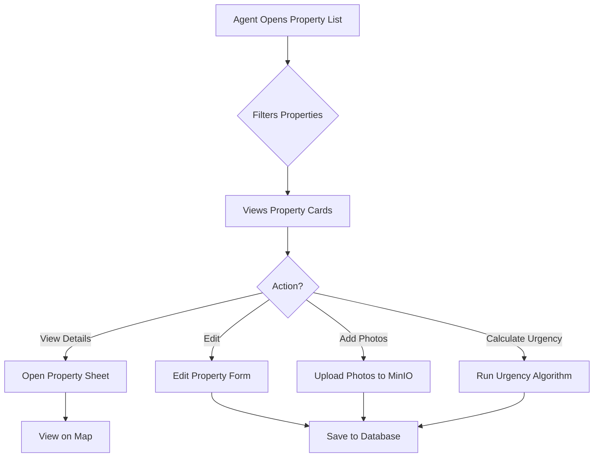
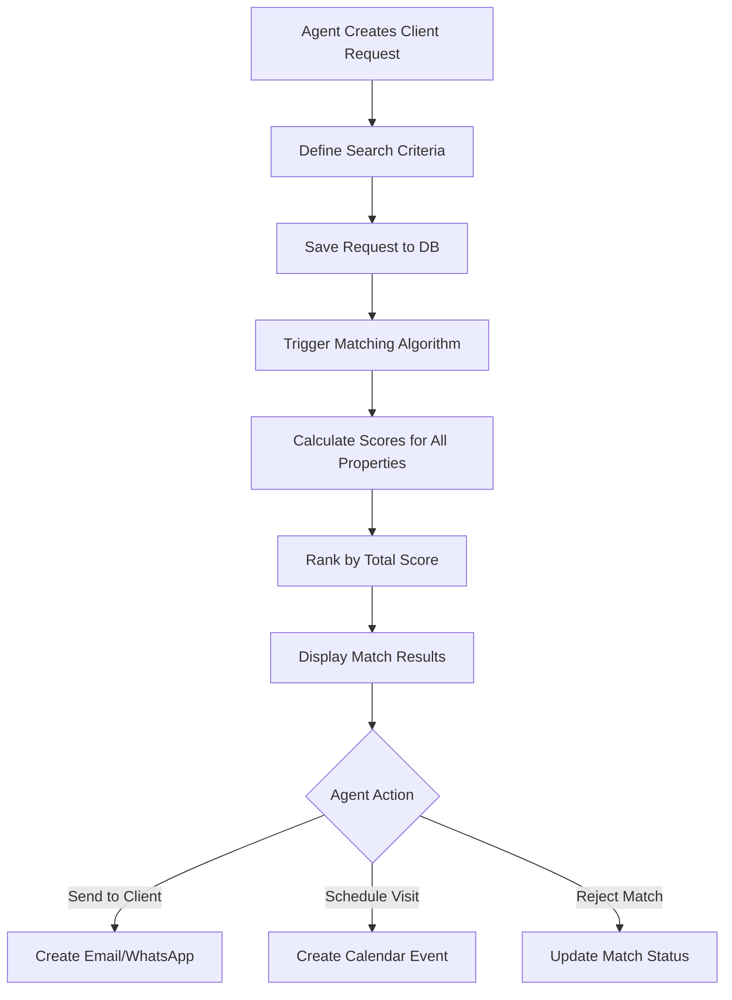
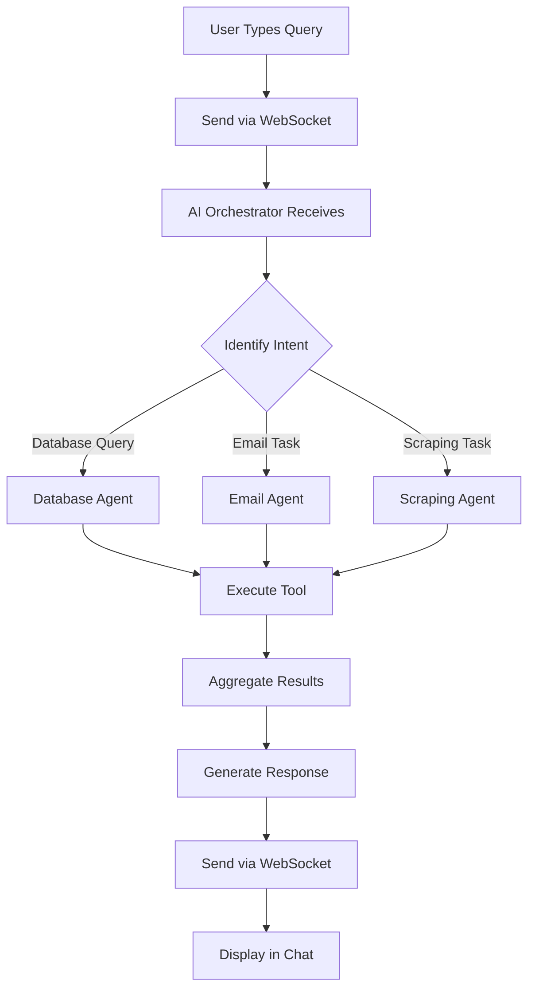
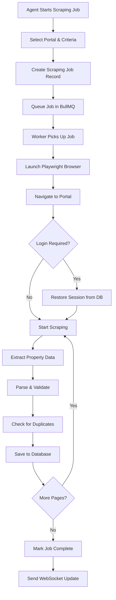
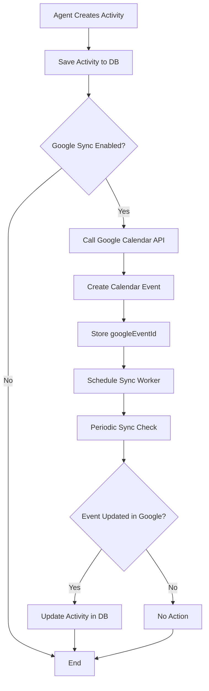
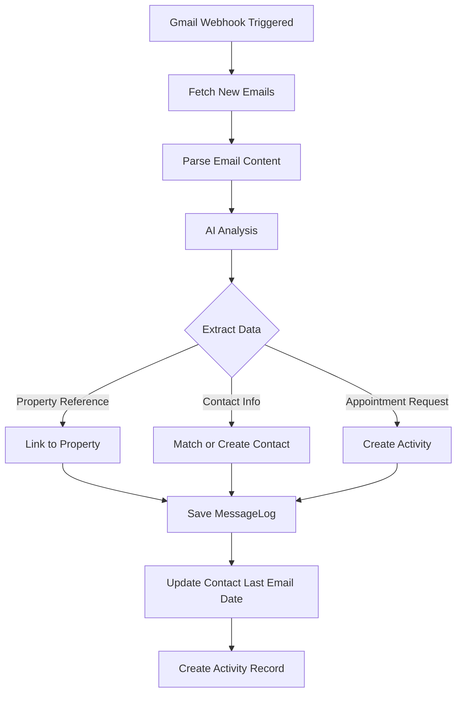
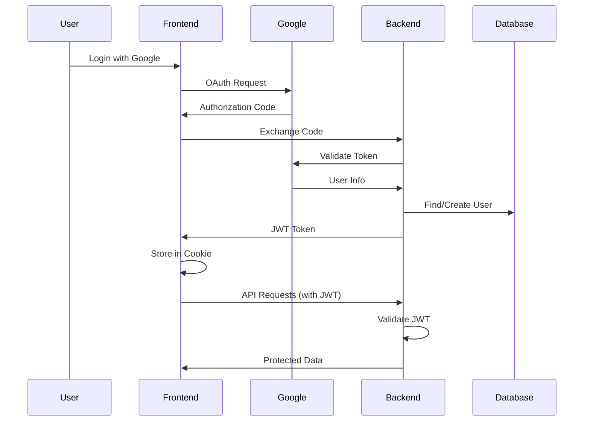
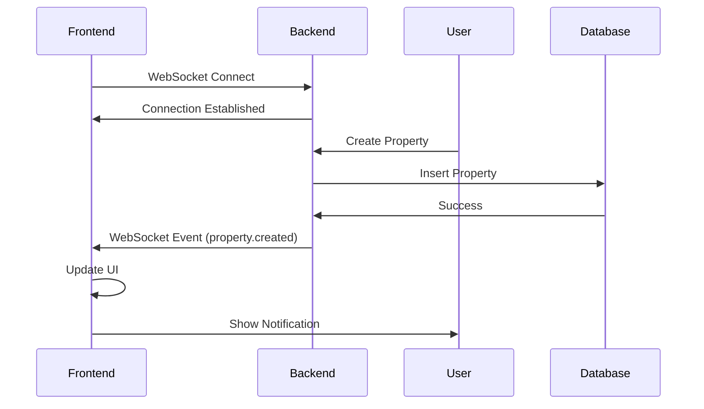
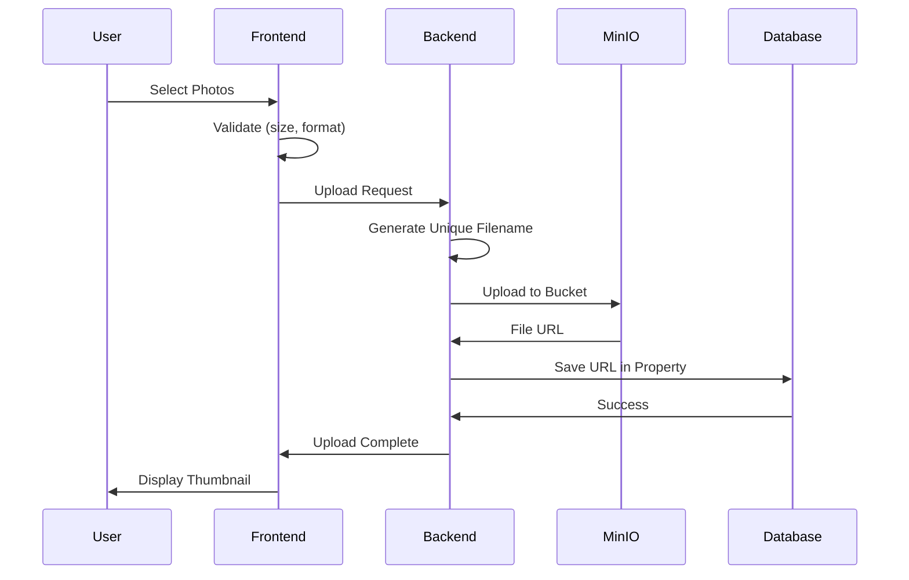

# System Flows

## User Flows

### 1. Property Management Flow



### 2. Client Matching Flow



### 3. AI Assistant Flow



### 4. Web Scraping Flow



### 5. Google Calendar Sync Flow



### 6. Email Integration Flow



## Technical Flows

### 1. Authentication Flow (Future)



### 2. Real-time Updates Flow



### 3. File Upload Flow



## Background Job Flows

### 1. Urgency Calculation Job

```
Trigger: Daily cron job (midnight)
↓
Fetch all active properties
↓
For each property:
  Calculate days on market
  Check last activity date
  Check property status
  Calculate urgency score (0-5)
  Update property.urgencyScore
↓
Update building.avgUrgency (aggregated)
↓
Send notification for urgent properties (score >= 4)
```

### 2. Calendar Sync Job

```
Trigger: Every 5 minutes
↓
Fetch IntegrationAuth records (provider=google_calendar)
↓
For each active integration:
  Fetch lastSyncToken
  Call Google Calendar API (incremental sync)
  Process new/updated/deleted events
  Create/Update/Delete Activity records
  Update lastSyncToken
  Update lastSyncAt
↓
Handle errors (retry with backoff)
```

### 3. Email Processing Job

```
Trigger: On new email received (webhook)
↓
Create MessageProcessing record (status=pending)
↓
Worker picks up job
↓
Parse email content (body, attachments, metadata)
↓
AI Analysis:
  Extract entities (contact, property, dates)
  Classify email category
  Determine sentiment
  Extract priority
↓
Match to existing Contact (or create)
↓
Create Activity if needed
↓
Update MessageLog with AI analysis
↓
Mark MessageProcessing as completed
```

## Error Handling Flows

### Retry Strategy

```
Job fails
↓
Check attempts < maxAttempts
↓
Calculate backoff delay (exponential)
  - Attempt 1: 2 seconds
  - Attempt 2: 4 seconds
  - Attempt 3: 8 seconds
↓
Update nextRetryAt
↓
Worker picks up job again
↓
If still fails after maxAttempts:
  Mark as failed
  Log error
  Send admin notification
```
